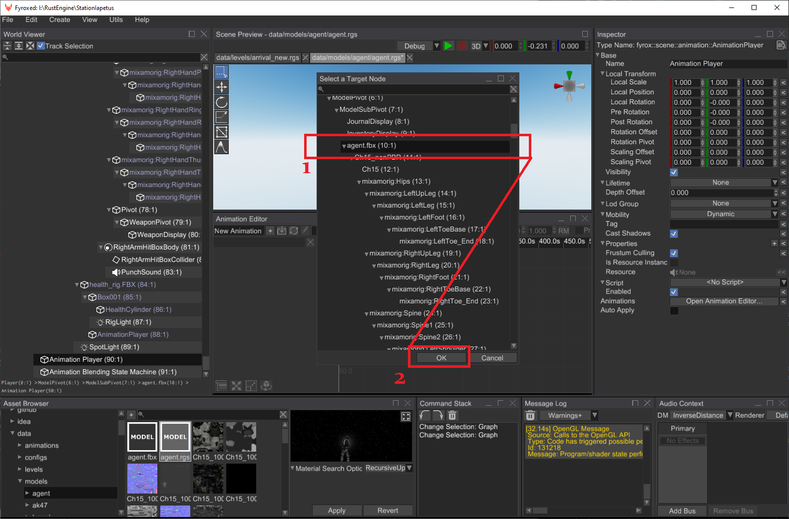
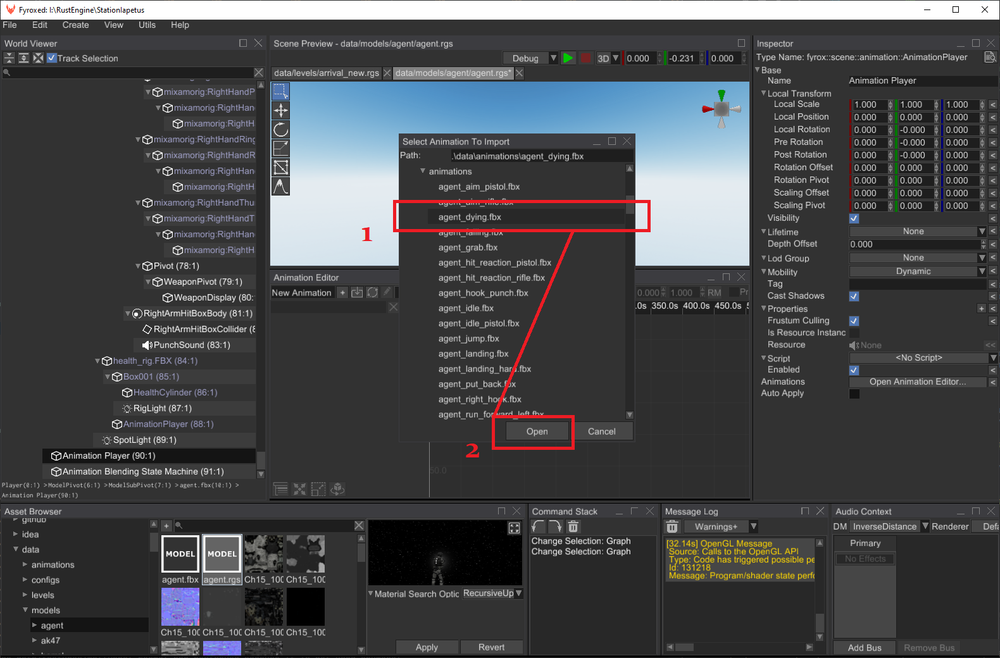
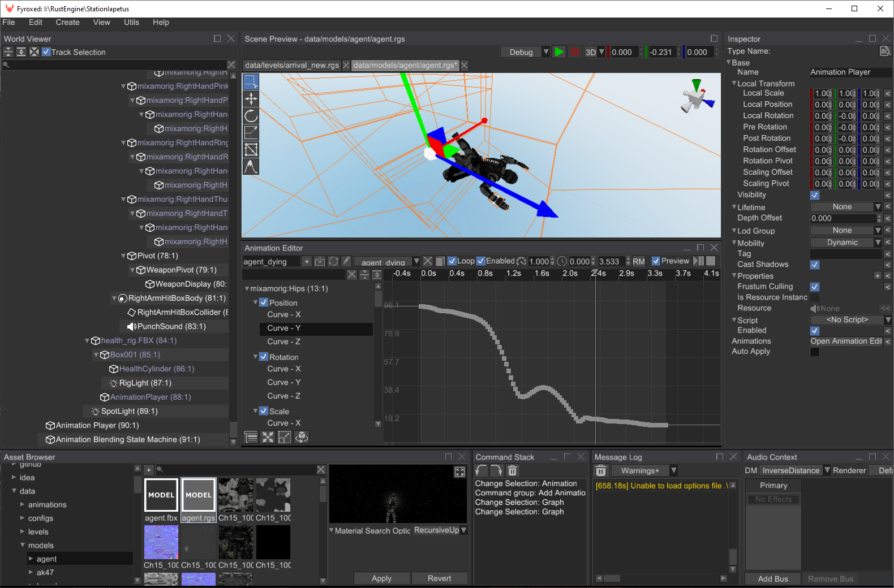

# Animation

Animation allows you to change properties of scene nodes at runtime using a set of key frames. Animation
consists of multiple tracks, where each track is bound to a property of a scene node. A track can animate
any numeric properties, starting from numbers (including `bool`) end ending by 2/3/4 dimensional vectors.
Each component (number, x/y/z/w vector components) is stored in a _parametric curve_ (see
[`crate::core::curve::Curve`] docs for more info). Every parametric curve contains zero or more _key frames_.
Graphically this could be represented like so:

```text
                                         Timeline
                                            v
  Time   > |---------------|------------------------------------>
           |               |
  Track1 > | node.position |                                     
           |   X curve     |..1..........5...........10..........
           |   Y curve     |..2.........-2..................1....  < Curve key frames
           |   Z curve     |..1..........9......................4
           |_______________|  
  Track2   | node.property |                                  
           | ............  |.....................................
           | ............  |.....................................
           | ............  |.....................................
```

Each key frame is just a real number with interpolation mode. Interpolation mode tells the engine how to
calculate intermediate values between key frames. There are three kinds of interpolation used in animations
(you can skip "boring math" if you want):

- **Constant** - intermediate value will be calculated using leftmost value of two. Constant "interpolation" is
  usually used to create step-like behaviour, the most common case is to "interpolate" two boolean values.
- **Linear** - intermediate value will be calculated using linear interpolation `i = left + (right - left) / t`,
  where `t = (time_position - left) / (right - left)`. `t` is always in `0..1` range. Linear interpolation is usually
  used to create "straight" transitions between two values.
- **Cubic** - intermediate value will be calculated using Hermite cubic spline:
  `i = (2t^3 - 3t^2 + 1) * left + (t^3 - 2t^2 + t) * left_tangent + (-2t^3 + 3t^2) * right + (t^3 - t^2) * right_tangent`,
  where `t = (time_position - left) / (right - left)` (`t` is always in `0..1` range), `left_tangent` and `right_tangent`
  is usually a `tan(angle)`. Cubic interpolation is usually used to create "smooth" transitions between two values.

## Web Demo

You can explore animation system capabilities in this [web demo](https://fyrox.rs/assets/demo/animation/index.html). Keep
in mind, that it was designed to run on PC and wasn't tested on mobile devices.

## Track binding

Each track is always bound to a property in a node, either by its name or by a special binding. The name is used to fetch the
property using reflection, the special binding is a faster way of fetching built-in properties. It is usually used to animate
position, scale and rotation (these are the most common properties available in every scene node).

## Time slice and looping
While key frames on the curves can be located at arbitrary position in time, animations usually plays a specific time slice.
By default, each animation will play on a given time slice infinitely - it is called _animation looping_, it works in both
playback directions.

## Speed
You can vary playback speed in wide range, by default every animation has playback speed multiplier set to 1.0. The multiplier
tells how faster (>1) or slower (<1) the animation needs to be played. Negative speed multiplier values will reverse playback.

## Enabling or disabling animations
Sometimes there's a need to disable/enable an animation or check if it is enabled or not, you can do this by using the pair
of respective methods - [`Animation::set_enabled`] and [`Animation::is_enabled`].

## Signals
Signal is a named marker on specific time position on the animation timeline. Signal will emit an event if the animation playback
time passes signal's position from left-to-right (or vice versa depending on playback direction). Signals are usually used to
attach some specific actions to a position in time. For example, you can have a walking animation and you want to emit sounds
when character's feet touch ground. In this case you need to add a few signals at times when each foot touches the ground.
After that all you need to do is to fetch animation events one-by-one and emit respective sounds. See respective 
[chapter](signal.md) for more info.

## Creating From Code

Usually, animations are created from the editor or some external tool and then imported in the engine. Before trying the example
below, please read the docs for [`crate::scene::animation::AnimationPlayer`] node, it is much more convenient way of animating
other nodes. The node can be created from the editor and you don't even need to write any code.
Use the following example code as a guide **only** if you need to create procedural animations:

```rust,no_run
# extern crate fyrox;
# use fyrox::{
#     animation::{
#         container::{TrackDataContainer, TrackValueKind},
#         track::Track,
#         value::ValueBinding,
#         Animation,
#     },
#     core::{
#         curve::{Curve, CurveKey, CurveKeyKind},
#         pool::Handle,
#     },
#     scene::{
#         node::Node,
#         base::BaseBuilder,
#         graph::Graph,
#         pivot::PivotBuilder
#     }
# };
fn create_animation(node: Handle<Node>) -> Animation {
    let mut frames_container = TrackDataContainer::new(TrackValueKind::Vector3);
    // We'll animate only X coordinate (at index 0).
    frames_container.curves_mut()[0] = Curve::from(vec![
        CurveKey::new(0.5, 2.0, CurveKeyKind::Linear),
        CurveKey::new(0.75, 1.0, CurveKeyKind::Linear),
        CurveKey::new(1.0, 3.0, CurveKeyKind::Linear),
    ]);
    // Create a track that will animated the node using the curve above.
    let mut track = Track::new(frames_container, ValueBinding::Position);
    track.set_target(node);
    // Finally create an animation and set its time slice and turn it on.
    let mut animation = Animation::default();
    animation.add_track(track);
    animation.set_time_slice(0.0..1.0);
    animation.set_enabled(true);
    animation
}
// Create a graph with a node.
let mut graph = Graph::new();
let some_node = PivotBuilder::new(BaseBuilder::new()).build(&mut graph);
// Create the animation.
let mut animation = create_animation(some_node);
// Emulate some ticks (like it was updated from the main loop of your game).
for _ in 0..10 {
    animation.tick(1.0 / 60.0);
    animation.pose().apply(&mut graph);
}
```

The code above creates a simple animation that moves a node along X axis in various ways. The usage of the animation
is only for the sake of completeness of the example. In the real games you need to add the animation to an animation
player scene node, and it will do the job for you.

## Importing

It is also possible to import an animation from external source (such as FBX files). You can do this in two major
ways: from code or from the editor. The following sections shows how to use both ways.

### From Editor

At first, make sure that you have your 3D model instantiated in the scene. The following example has `agent.fbx`
instance in the scene (to do that, just drag'n'drop your 3D model in the scene from the Asset Browser). To import 
an animation you need to create an `Animation Player` scene node, open the [Animation Editor](anim_editor.md) and
click the button with arrow-down icon:


Now you need to pick the root node of your 3D model to which you'll import your animation. Usually it will be called
the same as your 3D model (`agent.fbx` on the screenshot below):



The last thing you need to do is to pick the animation you want to import:



If everything is correct, you can preview your animation by clicking `Preview` checkbox:



### From Code

You can do the same as in the previous section, but from code:

```rust ,edition2018,no_run
# extern crate fyrox;
# use fyrox::{
#     asset::manager::ResourceManager,
#     core::pool::Handle,
#     resource::model::{Model, ModelResourceExtension},
#     scene::{animation::AnimationPlayerBuilder, base::BaseBuilder, node::Node, Scene},
# };
# 
async fn create_animated_character(
    scene: &mut Scene,
    resource_manager: &ResourceManager,
) -> (Handle<Node>, Handle<Node>) {
    // Load a character model first.
    let character_resource = resource_manager
        .request::<Model>("path/to/my/character.fbx")
        .await
        .unwrap();

    // Create its instance.
    let character_instance = character_resource.instantiate(scene);

    // Create a new animation player.
    let animation_player =
        AnimationPlayerBuilder::new(BaseBuilder::new()).build(&mut scene.graph);

    // Load an animation.
    let animation_resource = resource_manager
        .request::<Model>("path/to/my/animation.fbx")
        .await
        .unwrap();

    // "Instantiate" an animation from the animation resource to the animation player.
    // You can call this method multiple times with different animations, each time it
    // will create a new animation instance and put it in the animation player.
    let _animations = animation_resource.retarget_animations_to_player(
        character_instance,
        animation_player,
        &mut scene.graph,
    );

    (character_instance, animation_player)
}
```

As you can see, at first this code creates an instance of a 3D model. Then it loads an animation and creates its
instance in the animation player. Please note, that this code uses `async`, which produces a future which should
be driven by some executor. You can use `block_on` method to execute it at call site (this won't work on WebAssembly).

It is advised to prefer the editor to code approach, because it hides all this tedious code and properly handles 
asynchronous loading on all platforms.

## Playing an Animation

Animations will be played automatically if the respective animation player is has the property `Auto Apply` set to
`true`. Since the animation player can contain multiple animations, all of them will be played at once. You can 
enable/disable animations when needed by finding them by name from code and switching `Enabled` property:

```rust ,edition2018,no_run
# extern crate fyrox;
# use fyrox::{
#     core::pool::Handle,
#     scene::{animation::AnimationPlayer, graph::Graph, node::Node},
# };
# 
fn enable_animation(
    animation_player: Handle<Node>,
    graph: &mut Graph,
    name: &str,
    enabled: bool,
) {
    if let Some(animation_player) =
        graph.try_get_mut_of_type::<AnimationPlayer>(animation_player)
    {
        // `get_value_mut_silent` prevents marking the variable as modified (see Property Inheritance
        // chapter for more info).
        let animations = animation_player.animations_mut().get_value_mut_silent();

        // Find an animation with the given name.
        if let Some((_animation_handle, animation)) = animations.find_by_name_mut(name) {
            // You could also store _animation_handle somewhere and use  animations.get_mut/get(handle)
            // to fetch an animation faster.

            // Turn the animation on/off.
            animation.set_enabled(enabled);
        }
    }
}
```

This code could also be used to change animation properties at runtime. To do that, replace `set_enabled` with some
other methods, such as `set_speed`, `set_loop`, `set_root_motion_settings` etc.