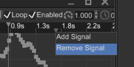
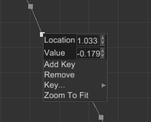
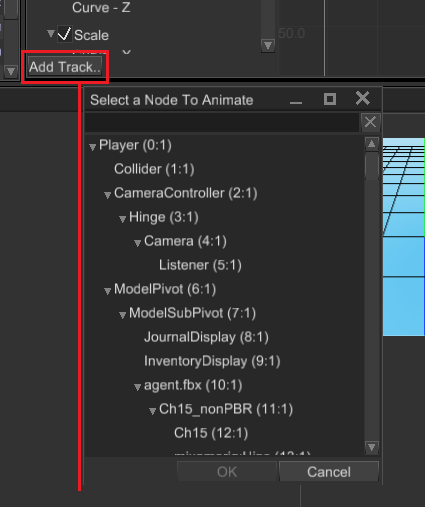
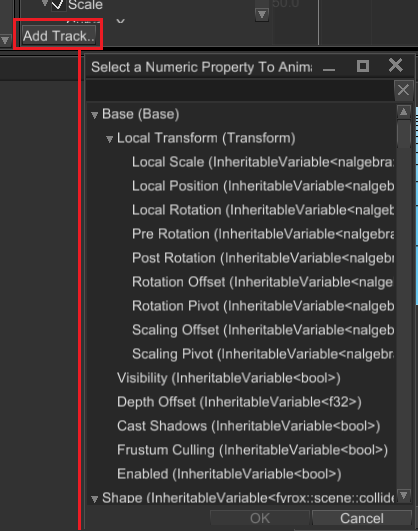
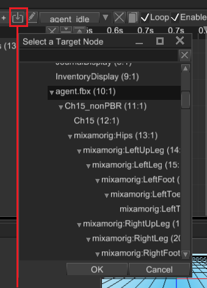
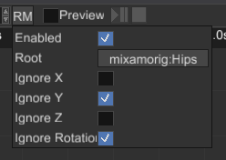
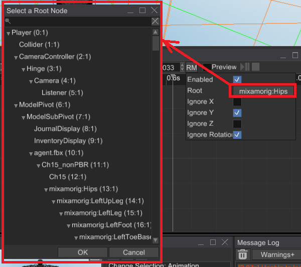

# Animation Editor

Animation Editor is a tool that helps you to create and preview animations. This is a powerful tool that can be used
to animated pretty much any numeric property. It has three main parts:

1. `Toolbar` - contains a set of tools that changes a particular part of an animation (name, length, speed, etc.)
2. `Track List` - contains a list of tracks of nodes that will be animated.
3. `Curve Editor` - curve editor allows you to edit behaviour of a numeric parameter over the time. 

The editor can be opened in two ways - using `Utils -> Animation Editor` or by selecting an animation player node and
clicking `Open Animation Editor` button in the inspector.

In both ways you still need to select an animation player for editing.

## Toolbar

The toolbar contains a set of tools that changes a particular part of an animation (name, length, speed, etc.). It looks
like this:

1. `Animation Name` - name of a currently selected animation.
2. `Add Animation` - adds a new empty animation with the name from the text box at the left to the animation player. 
3. `Import Animation` - starts animation importing process. See [Animation Importing](#animation-importing) section
for more info.
4. `Reimport Animation` - re-imports the animation from an external file, it is useful if you need to change animation's
content, while keep references to it valid.
5. `Rename Animation` - renames a currently selected animation using the name from the text box at the left.
6. `Animation Selector` - allows you to switch currently edited animation.
7. `Delete Animation` - deletes a currently selected animation, tries to select last animation from the list if possible.
8. `Duplicate Animation` - clones a currently selected animation.
9. `Loop Animation` - enables or disables looping of a currently selected animation.
10. `Enable Animation` - enables or disables a currently selected animation.
11. `Animation Speed` - sets a new playback speed of a currently selected animation.
12. `Time Slice` - a time range (in seconds) which defines start and end time of a currently selected animation.
13. `Root Motion` - open root motion settings. See [Root Motion](#root-motion) section for more info.
14. `Preview Switch` - enables or disables animation preview. See [`Preview Mode`](#preview-mode) section for more info.
15. `Play/Pause` - plays or pauses a currently selected animation (allowed only in the preview mode).
16. `Stop` - stops a currently selected animation (allowed only in the preview mode).

## Track List

The track list contains a list of tracks of nodes that will be animated. It looks like this:

1. `Filter Bar` - filters the track list by finding tracks whose names matching the filter. You can use this to find
tracks that belong to a particular scene node.
2. `Clear Filter` - clears the filter, the track list will show all the tracks after this.
3. `Collapse All` - collapses all the tracks in the list.
4. `Expand All` - expands all the tracks in the list.
5. `Track` - a track with some number of children parametric curves.
6. `Track Component Curve` - parametric curve that serves a data source for the animation for a particular track.
7. `Track Switch` - enables or disables a track; disabled tracks won't "touch" their properties.
8. `Add Track` - starts property binding process, see [Property Binding](#property-binding) section for more info.

### Track Context Menu

- `Remove Selected Tracks` - removes selected tracks; you can remove multiple tracks at a time by selecting them while
holding `Ctrl`.

## Curve Editor

Curve editor allows you to edit parametric curves (one at a time). A curve consists of zero or more key frames with 
various transition rules between current and the next. The editor looks like this:

1. `Time Ruler` - shows time values and every signal of a currently selected animation. A click on the time ruler will
move the playback cursor at the click position. You can move it by clicking at the cursor and moving the mouse while 
holding the left mouse button. Animation signals can be moved in the same fashion.
2. `Parametric Curve` - a curve that defines how a value changes over time.
3. `Time Thumb` - animation playback cursor, useful only for preview.
4. `Animation Signal` - some animation signal that will produce animation events when the playback cursor passes it. 

### Time Ruler Context Menu

- `Remove Signal` - removes an animation signal under the mouse cursor.
- `Add Signal` - adds a new animation signal at the mouse cursor position.

### Key Frame Context Menu

- `Location` - shows a key location and allows you to change it. Useful for setting precise values. 
- `Value` - shows a key value and allows you to change it. Useful for setting precise values.
- `Add Key` - adds a new key to the curve.
- `Remove` - removes all selected keys. You can select multiple keys either by box selection (click and drag the mouse
to active box selection) or by clicking on separate keys while holding `Ctrl`.
- `Key...` - allows you to change the interpolation type of key. It could be one of the following values: Constant, Linear,
Cubic.
- `Zoom To Fit` - tries to find zooming values (for both axes) and the view position with which the entire curve fits in
the viewport.

## Property Binding

To animate a property all you need to do is to click on `Add Track...` button at the bottom of the track list, select
a node to animate and then select a property that will be animated. There are two windows that will be shown one after
another:

You can cancel property binding at any time by clicking `Cancel` in any of the windows. Keep in mind that you can animate
only numeric properties, so not every property is shown in the window.

## Animation Importing

Animations can be stored in separate files, but the engine requires all of them to be in a single Animation Player. To
put an animation from an external resource (an FBX, for instance) in the animation player you can use animation 
importing. To do that, click on animation import icon and then select a root node of the hierarchy that is animated in
the external animation file, then select the animation file and click `Ok`. The engine will try to import the animation
and map it to the given hierarchy, mapping is done using node names, so animated node names must match in both your 
scene and your external animation file. 

Content of existing animations can be replaced by reimporting. Click on a button with two circular arrows to reimport 
your animation. It could be useful if you changed your animation in some external editor (Blender for example) and want
to apply changes in your game.

## Preview Mode

Preview mode helps you to see and debug your animation. After activating the mode, you need to play the animation by
clicking the `Play/Pause` button:

Any significant change made in the scene will automatically deactivate the preview mode reverting all the changes made
by playing animation.

## Root Motion

Root motion is a special technique that transfers motion from some node in a hierarchy to a physical capsule, which is 
then used to perform the actual motion. You can enable/disable/setup it in the drop-down menu that opens by clicking `RM` 
button:

The most important part here is the `Root` handle, it should be set to a root node that moves by your animation, usually
it is called like "hips" or similar:

After that, you need to apply filters for axes - most of the locomotion animations "works" in oXZ plane, so Y axis should 
be ignored. Also, if you don't have any turns in your animation, you can also filter out the rotation part.

## Limitations

For now there's no dopesheet mode in the editor, you can edit only one numeric parameter at a time. Also, there's no 
capture mode - this is a special mode in which the editor automatically adds your changes in the scene to the animation.
These limitations will be removed in the future versions.