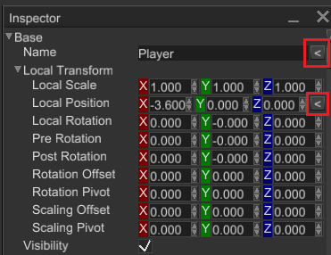

# Property Inheritance

**Important:** This functionality is available on [latest engine](../beginning/scripting.md#using-latest-engine-version)
from `master` branch only. It will be available in next major release (0.28).

Property inheritance is used to propagate changes of unmodified properties from a prefab to its instances. For example,
you can change scale of a node in a prefab and their instances will have the same scale too, unless the scale is not 
set explicitly in an instance. Such feature allows you to tweak instances, add some unique details to them, but take
generic properties from parent prefabs.

Property inheritance works for prefabs hierarchy of any depth, this means that you can create something like this:
a room prefab can have multiple instances of various furniture prefabs in it, while the furniture prefabs can also be
constructed from other prefabs and so on. In this case if you'll modify a property in one of prefabs in the chain, 
all instance will immediately sync their unmodified properties. 

## How To Create Inheritable Properties

It is possible to use property inheritance for script variables. To make a property of your script inheritable, all you
need is to wrap its value using `InheritableVariable` wrapper.

```rust
# extern crate fyrox;
# use fyrox::core::variable::InheritableVariable;
# use fyrox::core::reflect::Reflect;
# use fyrox::core::visit::prelude::*;
# use fyrox::core::inspect::prelude::*;
#[derive(Reflect, Visit, Inspect, Default, Clone, Debug)]
struct MyScript {
    foo: InheritableVariable<f32>
}
```

The engine will automatically resolve correct value for the property when a scene with the script is loaded. If your
property was modified, then its value will remain the same, it won't be overwritten by parent's value. Keep in mind,
that the type of inheritable variable must be cloneable and support reflection.

`InheritableVariable` implements `Deref<Target = T> + DerefMut` traits, this means that any access via `DerefMut` trait
will mark property as modified. This could be undesired in some cases, `InheritableVariable` supports special `xxx_silent` 
methods that don't touch internal modifiers storage and allows you to substitute the value with some other "silently" -
without marking the variable as modified.

## Editor

The editor wraps all inheritable properties in a special widget that supports property reversion. Reversion allows you
to drop current changes and take parent's property value. This is useful if you want a property to inherit parent's 
value. In the Inspector it looks like this:



Clicking on `<` button will take value from parent prefab and the property won't be marked as modified anymore. In case
if there is no parent prefab, the button will just drop `modified` flag.