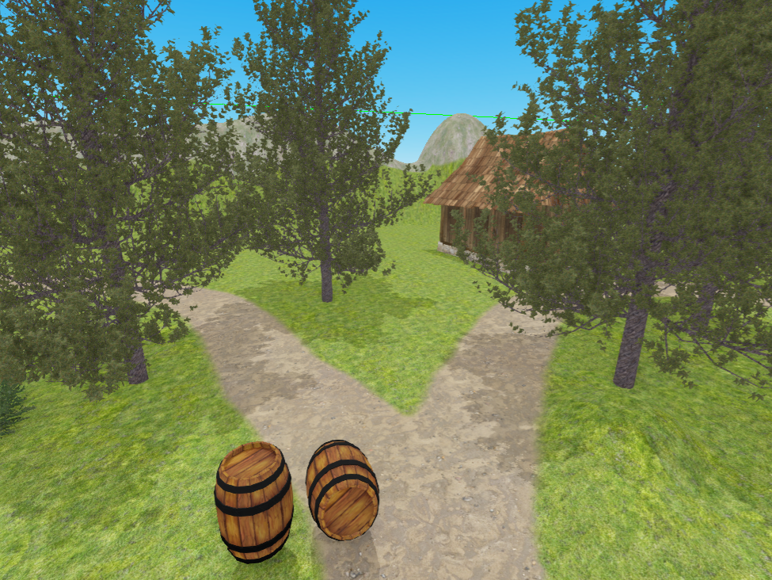
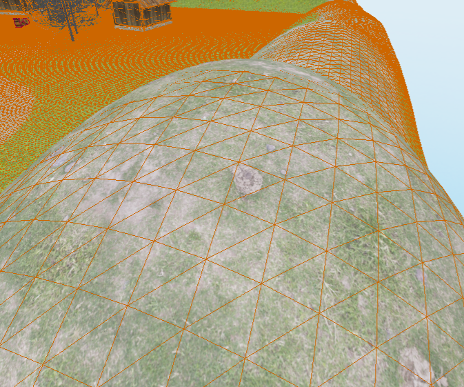
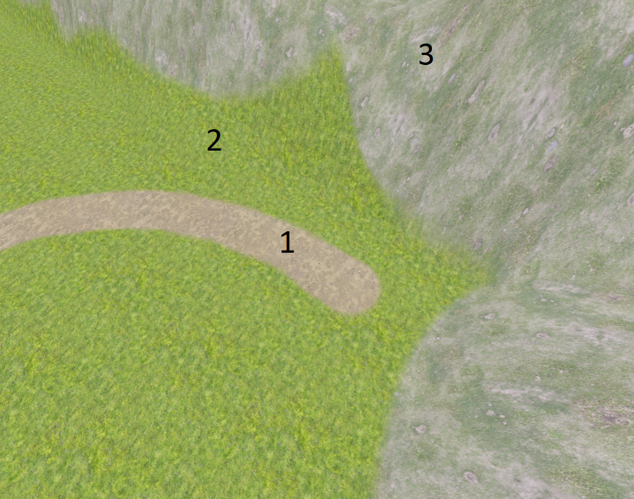
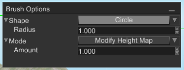
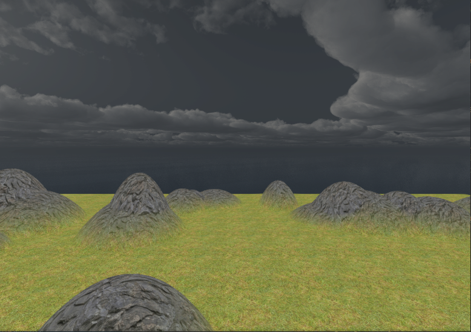

# Terrain

Terrain is a scene node that represents uniform grid of cells where each cell can have different height. Other, commonly
known name for terrain is heightmap. Terrains used to create maps for open-world games, it be used to create hills,
mountains, plateau, roads, etc.



## Basic concepts

There are few basic concepts that you should understand before trying to use terrains. This will help you to understand
design decisions and potential use cases.

### Heightmap

As it was already mentioned, terrain is a uniform grid where X and Z coordinates of cells have fixed values, while Y
can change. In this case we can store only width, height and resolution numerical parameters to calculate X and Z coordinates,
while Y is stored in a separate array which is then used to modify heights of cells. Such array is called _heightmap_.



### Layers

Layer is a material + mask applied to terrain's mesh. Mask is a separate, greyscale texture that defines in which parts
of the terrain the material should be visible or not. White pixels in the mask makes the material to be visible, black -
completely transparent, everything between helps you to create smooth transitions between layers. Here's a simple 
example of multiple layers:



There are 3 layers: 1 - dirt, 2 - grass, 3 - rocks and grass. As you can see, there are smooth transitions between each
layer, it is achieved by layer's mask.

Each layer uses separate material, which can be edited from respective property editor in the Inspector:


## Creating terrain in the editor

You can create a terrain node by clicking `Create -> Terrain`. It will create a terrain with fixed width, height, 
and resolution (see [limitations](./terrain_node.md#limitations-and-known-issues)). Once the terrain is created, select
it in the World Viewer and click on Hill icon on the toolbar. This will enable terrain editing, brush options panel 
should also appear. See the picture below with all the steps:


The green rectangle on the terrain under the cursor represents current brush. You can edit brush options in the 
`Brush Options` window:



You can select a shape (either circle or rectangle with configurable size) and a mode (either modify the height map, or
draw on mask of specific layer).

When editing terrain's height, left mouse button raises height map, but if `Shift` key is pressed it lowers it instead.
Something similar is applied to the mask editing - left mouse button draws, but if hold `Shift` - it will erase mask
content.

## Creating terrain from code

Terrain can always be created from code, here's comprehensive example of how to create and modify terrain from code:

```rust
# extern crate fyrox;
# use fyrox::{
#     core::{
#         algebra::Vector2, algebra::Vector3, parking_lot::Mutex, pool::Handle,
#         sstorage::ImmutableString,
#     },
#     engine::resource_manager::ResourceManager,
#     material::{shader::SamplerFallback, Material, PropertyValue},
#     rand::{thread_rng, Rng},
#     scene::{
#         base::BaseBuilder,
#         graph::Graph,
#         node::Node,
#         terrain::{Brush, BrushMode, BrushShape, LayerDefinition, TerrainBuilder},
#     },
# };
# use std::sync::Arc;
# 
fn setup_layer_material(
    material: &mut Material,
    resource_manager: ResourceManager,
    diffuse_texture: &str,
    normal_texture: &str,
) {
    material
        .set_property(
            &ImmutableString::new("diffuseTexture"),
            PropertyValue::Sampler {
                value: Some(resource_manager.request_texture(diffuse_texture)),
                fallback: SamplerFallback::White,
            },
        )
        .unwrap();
    material
        .set_property(
            &ImmutableString::new("normalTexture"),
            PropertyValue::Sampler {
                value: Some(resource_manager.request_texture(normal_texture)),
                fallback: SamplerFallback::Normal,
            },
        )
        .unwrap();
    material
        .set_property(
            &ImmutableString::new("texCoordScale"),
            PropertyValue::Vector2(Vector2::new(10.0, 10.0)),
        )
        .unwrap();
}

fn create_random_two_layer_terrain(graph: &mut Graph, resource_manager: &ResourceManager) -> Handle<Node> {
    let terrain = TerrainBuilder::new(BaseBuilder::new())
        .with_layers(vec![
            LayerDefinition {
                material: {
                    let mut material = Material::standard_terrain();
                    setup_layer_material(
                        &mut material,
                        resource_manager.clone(),
                        "examples/data/Grass_DiffuseColor.jpg",
                        "examples/data/Grass_NormalColor.jpg",
                    );
                    Arc::new(Mutex::new(material))
                },
                mask_property_name: "maskTexture".to_string(),
            },
            LayerDefinition {
                material: {
                    let mut material = Material::standard_terrain();
                    setup_layer_material(
                        &mut material,
                        resource_manager.clone(),
                        "examples/data/Rock_DiffuseColor.jpg",
                        "examples/data/Rock_Normal.jpg",
                    );
                    Arc::new(Mutex::new(material))
                },
                mask_property_name: "maskTexture".to_string(),
            },
        ])
        .build(graph);

    let terrain_ref = graph[terrain].as_terrain_mut();

    // Draw something on the terrain.
    for _ in 0..60 {
        let x = thread_rng().gen_range(4.0..60.00);
        let z = thread_rng().gen_range(4.0..60.00);
        let radius = thread_rng().gen_range(2.0..4.0);
        let height = thread_rng().gen_range(1.0..3.0);

        // Pull terrain.
        terrain_ref.draw(&Brush {
            center: Vector3::new(x, 0.0, z),
            shape: BrushShape::Circle { radius },
            mode: BrushMode::ModifyHeightMap { amount: height },
        });

        // Draw rock texture on top.
        terrain_ref.draw(&Brush {
            center: Vector3::new(x, 0.0, z),
            shape: BrushShape::Circle { radius },
            mode: BrushMode::DrawOnMask {
                layer: 1,
                alpha: 1.0,
            },
        });
    }

    terrain
}
```

As you can see there is quite a lot of code, ideally you should use editor all the times, because handling everything
from code could be very tedious. The result of its execution (if all textures are set correctly) could be something 
like this (keep in mind that terrain will be random everytime you run the code):



## Physics

By default, terrains does not have respective physical body and shape, it should be added manually. Create a static 
rigid body node with a collider with Heightmap shape ([learn more about colliders](../physics/collider.md)). Then attach
the terrain to the rigid body. Keep in mind that terrain's origin differs from Heightmap rigid body, so you need to offset 
the terrain to match its physical representation. Enable physics visualization in editor settings to see physical shapes 
and move terrain. Now to move the terrain you should move the body, instead of the terrain (because of parent-child 
[relations](../beginning/scene_and_scene_graph.md#local-and-global-coordinates)).

## Performance 

Terrain rendering complexity have linear dependency with the amount of layers terrain have. Each layer forces the engine
to re-render terrain's geometry with different textures and mask. Typical amount of layers is from 4 to 8. For example,
a terrain could have the following layers: dirt, grass, rock, snow. This is a relatively lightweight scheme. In any case,
you should measure frame time to understand how each new layer affects performance in your case.

## Limitations and known issues

There is no way to cut holes in the terrain yet, it makes impossible to create caves. There is also no way to create 
ledges, use separate meshes to imitate this. See [tracking issue](https://github.com/FyroxEngine/Fyrox/issues/351) for
more info.

For now, it is not possible to change width, height, and resolution of terrain, default values may be either too
small or too high, depending on your game. See [tracking issue](https://github.com/FyroxEngine/Fyrox/issues/352) for 
more info.

There is no way to flatten terrain slopes in the editor. See [tracking issue](https://github.com/FyroxEngine/Fyrox/issues/353)
for more info.

There is no level-of-detail for terrain chunks, so distant pieces of terrain will be renderer with the same quality as
close ones. This may hurt performance in case of large terrains. See [tracking issue](https://github.com/FyroxEngine/Fyrox/issues/127)
for more info.