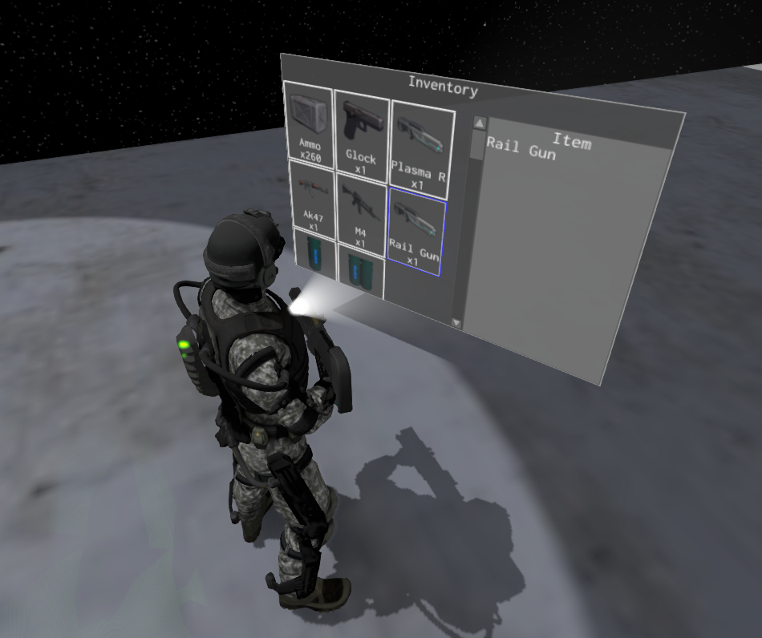
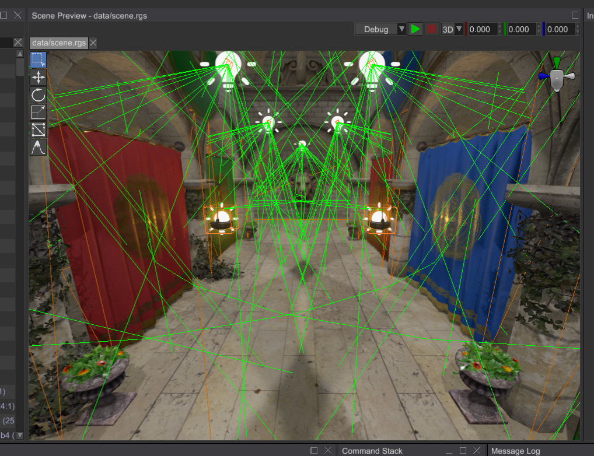

# Rendering

User interface is usually rendered directly on screen, and in most cases this is enough. However, there are some 
specific cases when you need to incorporate user interface in your game scene as an interactive screen (holographic,
for example) or to render some scene inside some UI element (to create some sort of in-game CCTV, for example). This
chapter covers these specific cases and rendering nuances in general.

## Offscreen Rendering

Offscreen rendering is used to render a UI into a texture, so it can be later used in your game scene. Here's a simple
example - holographic inventory in sci-fi games:



Default engine's user interface instance (accessible in `context.user_interface` from plugin methods) can't be rendered
offscreen due to engine design. However, you can create a new user interface instance, populate it with widgets, and 
then render it to a texture. This could be done like so:

```rust,no_run
# extern crate fyrox;
# use fyrox::{
#     core::{algebra::Vector2, log::Log, pool::Handle, sstorage::ImmutableString},
#     engine::GraphicsContext,
#     event::Event,
#     event_loop::ControlFlow,
#     gui::{button::ButtonBuilder, widget::WidgetBuilder, UserInterface},
#     material::{Material, PropertyValue},
#     plugin::{Plugin, PluginContext},
#     resource::texture::{TextureResource, TextureResourceExtension},
#     scene::Scene,
#     utils,
# };
# 
struct Game {
    // Add these fields to your game.
    my_ui: UserInterface,
    render_target: TextureResource,
    screen_size: Vector2<f32>,
}

impl Game {
    pub fn new(override_scene: Handle<Scene>, context: PluginContext) -> Self {
        // Add this code to your Game::new
        
        // Define the desired render target size.
        let width = 128;
        let height = 128;

        // Create render target and user interface.
        let render_target = TextureResource::new_render_target(width, height);
        let screen_size = Vector2::new(width as f32, height as f32);
        let mut my_ui = UserInterface::new(screen_size);

        // Create some widgets as usual.
        ButtonBuilder::new(WidgetBuilder::new())
            .with_text("Click Me!")
            .build(&mut my_ui.build_ctx());

        // Use render_target as an ordinary texture - it could be applied to any material like so:
        let material = Material::standard();
        Log::verify(material.set_property(
            &ImmutableString::new("diffuseTexture"),
            PropertyValue::Sampler {
                value: Some(render_target),
                fallback: Default::default(),
            },
        ));
        // This material **must** be assigned to some mesh in your scene!

        Self {
            my_ui,
            render_target,
            screen_size,
        }
    }
}

impl Plugin for Game {
    fn on_os_event(
        &mut self,
        event: &Event<()>,
        context: PluginContext,
        control_flow: &mut ControlFlow,
    ) {
        // This is the tricky part. Event OS event handling will be different depending on the use case.
        // In cases if your UI just shows some information, this method can be fully removed. In case when
        // you need to interact with the UI, there are two different ways.
        // 1) If your UI will be incorporated in 2D scene, you need to patch mouse events - mostly positions
        // of the cursor so it will be in local coordinates.
        // 2) In 3D, it is much more complex - you need to patch mouse events as well, but use mouse OS events
        // to produce a picking ray and do an intersection test with a quad that will serve as a canvas for your
        // UI to obtain the local mouse coordinates.
        if let Event::WindowEvent { event, .. } = event {
            if let Some(event) = utils::translate_event(event) {
                self.my_ui.process_os_event(&event);
            }
        }
    }

    fn update(&mut self, context: &mut PluginContext, control_flow: &mut ControlFlow) {
        // It is very important to update the UI every frame and process all events that
        // comes from it.
        self.my_ui.update(self.screen_size, context.dt);

        while let Some(message) = self.my_ui.poll_message() {
            // Do something with the events coming from the custom UI.
        }
    }

    fn before_rendering(&mut self, context: PluginContext, control_flow: &mut ControlFlow) {
        // Render the UI before every other rendering operation, this way the texture will be ready for use immediately.
        if let GraphicsContext::Initialized(ref mut graphics_context) = context.graphics_context
        {
            Log::verify(
                graphics_context
                    .renderer
                    .render_ui_to_texture(self.render_target.clone(), &mut self.my_ui),
            );
        }
    }
}
```

There's quite a lot of code, but it is quite simple and the comments should help you to understand which part does what.
It uses standard plugin structure and contents of each method should be placed in the according methods in your game.
This code creates a new user interface, a render target of appropriate size and renders the UI into the render
target. The render target then could be used as a diffuse texture in one of your materials, which in its turn, can
be assigned to pretty much any mesh in your game. 

## Embedding Scene into UI

It is possible to "embed" a scene into arbitrary user interface. This could be useful if you need to create some sort
of CCTV, or to show 3D graphics in 2D user interface and so on. To do so, you need to specify a render target for your
scene and then use the texture (render target) in an `Image` widget.

```rust,no_run
# extern crate fyrox;
# use fyrox::{
#     core::pool::Handle,
#     gui::{image::ImageBuilder, widget::WidgetBuilder, UiNode},
#     plugin::PluginContext,
#     resource::texture::{TextureResource, TextureResourceExtension},
#     scene::Scene,
#     utils,
# };
# 
fn reroute_scene_rendering(
    width: u32,
    height: u32,
    scene: &mut Scene,
    context: &mut PluginContext,
) -> Handle<UiNode> {
    // Create render target first.
    let render_target = TextureResource::new_render_target(width, height);

    // Specify render target for the scene.
    scene.rendering_options.render_target = Some(render_target.clone());

    // The scene will be drawn in this image widget.
    ImageBuilder::new(
        WidgetBuilder::new()
            .with_width(width as f32)
            .with_height(height as f32),
    )
    .with_texture(utils::into_gui_texture(render_target.clone()))
    .build(&mut context.user_interface.build_ctx())
}
```

This function could be used as-is to re-route rendering of a scene to an `Image` widget. It creates a new render target
first, then it assigns it to the scene, and also it creates a new `Image` widget with the render target as a texture.
A simple example of what this code does is the scene previewer in the editor:



If you set `width` and `height` to match your screen size, you'll create a simple "overlay" that will allow you to 
render scene entities on top of the UI. In this case, however, you also need to configure scene camera accordingly,
and probably use orthographic projection so the coordinates would match.