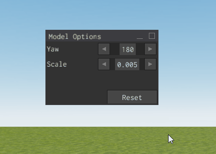

# Window



The Window widget provides a standared window that can contain another widget. Based on setting windows can be configured
so users can do any of the following:

* Movable by the user. Not configurable.
* Have title text on the title bar. Set by the *with_title* function.
* Able to be exited by the user. Set by the *can_close* function.
* Able to be minimized to just the Title bar, and of course maximized again. Set by the *can_minimize* function.
* Able to resize the window. Set by the *can_resize* function.

As with other UI elements, you create and configure the window using the WindowBuilder.

```rust,no_run
# extern crate fyrox;
use fyrox::{
    core::{pool::Handle, algebra::Vector2},
    gui::{
        window::{WindowBuilder, WindowTitle}, 
        text::TextBuilder, 
        widget::WidgetBuilder, 
        UiNode, 
        UserInterface
    },
};

fn create_window(ui: &mut UserInterface) {
    WindowBuilder::new(
        WidgetBuilder::new()
            .with_desired_position(Vector2::new(300.0, 0.0))
            .with_width(300.0),
    )
    .with_content(
        TextBuilder::new(WidgetBuilder::new())
            .with_text("Example Window content.")
            .build(&mut ui.build_ctx())
    )
    .with_title(WindowTitle::text("Window"))
    .can_close(true)
    .can_minimize(true)
    .open(true)
    .can_resize(false)
    .build(&mut ui.build_ctx());
}
```

You will likely want to constrain the initial size of the window to somethig as shown in the example by providing a set
width and/or height to the base WidgetBuilder. Otherwise it will expand to fit it's content.

You may also want to set an inital position with the *with_desired_position* function called on the base WidgetBuilder 
which sets the position of the window's top-left corner. Otherwise all your windows will start with it's top-left corner
at 0,0 and be stacked on top of eachother.

Windows can only contain a single direct child widget, set by using the *with_content* function. 
Additional calls to *with_content* replaces the widgets given in previous calls, and the old widgets exist outside the 
window, so you should delete old widgets before changing a window's widget.  If you want multiple widgets, you need to 
use one of the layout container widgets like the Grid, Stack Panel, etc then add the additional widgets to that widget 
as needed.

The Window is a user editable object, but can only be affected by UI Messages they trigger if the message's corresponding
variable has been set to true aka what is set by the *can_close*, *can_minimize*, and *can_resize* functions.

## Initial Open State

By default, the window will be created in the open, or maximized, state. You can manually set this state via the *open*
function providing a true or false as desired.

## Styling the Buttons

The window close and minimise buttons can be configured with the *with_close_button* and *with_minimize_button* functions.
You will want to pass them a button widget, but can do anything else you like past that.

## Modal (AKA Forced Focus)

A Modal in UI design terms indicates a window or box that has forced focus. The user is not able to interact with anything 
else until the modal is dissmissed. 

Any window can be set and unset as a modal via the *modal* function.

