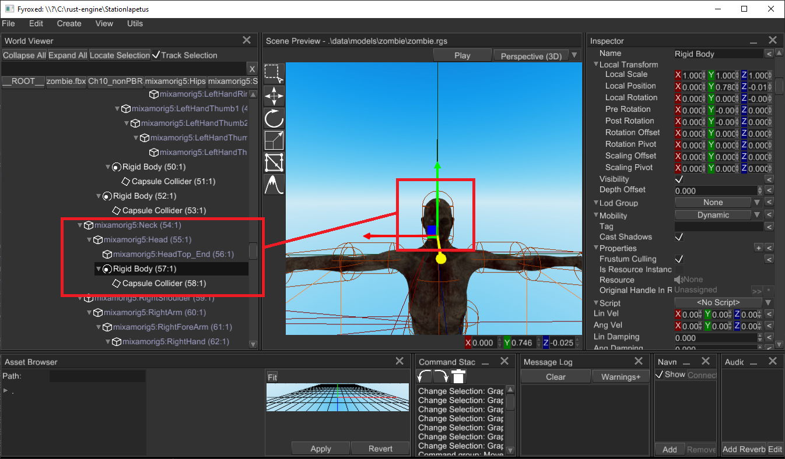

# Collider node

Collider is a geometrical shape that is used for collision detection, contact manifold generation, etc. Colliders are used
in pair with rigid bodies, they make rigid body participate in collisions.

**Important:** Colliders only works in pair with rigid bodies! Colliders won't be used by the engine, unless they're
direct children of a rigid body. Read [this chapter](./rigid_body.md#colliders) for more info. 

## Shapes

Collider can have almost any shape, the engine offers the following shapes for 3D:

- Ball - dynamic sphere shape.
- Cylinder - dynamic cylinder shape.
- Cone - dynamic cone shape.
- Cuboid - dynamic box shape.
- Capsule - dynamic capsule shape.
- Segment - dynamic segment ("line") shape
- Triangle - simple dynamic triangle shape
- Triangle mesh - static concave shape, can be used together with any static level geometry (wall, floors, ceilings,
anything else)
- Height field - static height field shape, can be used together with terrains.
- Polyhedron - dynamic concave shape.

Also, there is a similar, but smaller set for 2D (because some shapes degenerate in 2D):

- Ball - dynamic circle shape.
- Cuboid - dynamic rectangle shape.
- Capsule - dynamic capsule shape.
- Segment - dynamic segment ("line") shape.
- Triangle - dynamic triangle shape.
- Trimesh - static triangle mesh shape.
- Heightfield - static height field shape.

_Dynamic_ in both lists means that such shapes can be used together with _dynamic_ rigid bodies, they'll correctly handle
all collisions and simulation will look as it should. _Static_ means that such shape should be used only with _static_
rigid bodies.

## How to create

Use ColliderBuilder to create an instance of collider from code with any shape you want.

```rust,no_run
# extern crate fyrox;
# use fyrox::{
#     core::pool::Handle,
#     scene::{
#         base::BaseBuilder,
#         collider::{ColliderBuilder, ColliderShape},
#         graph::Graph,
#         node::Node,
#     },
# };
fn create_capsule_collider(graph: &mut Graph) -> Handle<Node> {
    ColliderBuilder::new(BaseBuilder::new())
        .with_shape(ColliderShape::capsule_y(0.5, 0.2))
        .with_friction(1.0)
        .build(graph)
}
```

In the editor you can use `MainMenu -> Create -> Physics -> Collider`, or right-click on a node in `World Viewer` and
select `Add Child -> Physics -> Collider`. Collider must be direct child of a rigid body, colliders do nothing on
their own!

## Collision filtering

Sometimes there's a need to prevent collision between various groups of colliders. Fyrox supports bit-wise collision 
filtering exactly for this purpose. For instance, you may have two groups of colliders: actors and powerups, and you
want the actors to completely ignore collisions with powerups (and vice versa). In this case you can set collision
groups for actors like so:


And set the collision groups for powerups like so:


As you can see, actors and powerups now have separate `memberships` (read - groups) and filters. This way, the actors
will collide with everything, but powerups and vice versa.

## Using colliders for hit boxes

You can use colliders to simulate hit boxes for your game characters. It can be done by creating a rigid body with
`KinematicPositionBased` type and an appropriate collider as a child node. As the last step you need to attach the body
to a bone in your character's model. Here's a quick example from the editor:



As you can see, the rigid body has a capsule collider as a child and the body is attached to the neck bone. The body
has `KinematicPositionBased` type, which will ensure that the body won't be simulated, instead its position will be 
synchronized with the position of the parent bone.

To actually use the hit boxes in your game, you can either use a ray-casting to perform a hit scan or you can use 
contacts information to fetch the stuff with which a hit box was contacted. See [Ray casting](./ray.md) chapter of the
section.