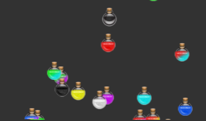

# Canvas



Canvas is a panel widget that allows you to explicitly set coordinates for children widgets. It is useful when you 
need to manually control position of children widgets (like potions on the image above). As any other panel widget, it
does not have its own graphical representation, so the image above shows only its positioning capabilities. Root UI node
is also canvas, so any widgets that are not attached to any other widgets can have explicit position.

## How to create

Use `CanvasBuilder` to create Canvas instance:

```rust,no_run
{{#include ../code/src/ui/canvas.rs:create_canvas}}
```

Canvas does not have any specific options, so its creation is probably simplest of all widgets.

## How to position children nodes

Use `.with_desired_position` on children widgets to set specific position:

```rust,no_run
{{#include ../code/src/ui/canvas.rs:create_canvas_with_children_widgets}}
```

The code snippet will create a canvas with a text widget located at (100.0, 200.0) relative to top-left corner of the
canvas and a button located at (200.0, 100.0).

## Tips

Canvas provides infinite bounds for children widgets, this means that children nodes **will not** be stretched, instead
they'll shrink to fit their content. For example, a button with a text will take slightly bigger rectangle than the 
text bounds.